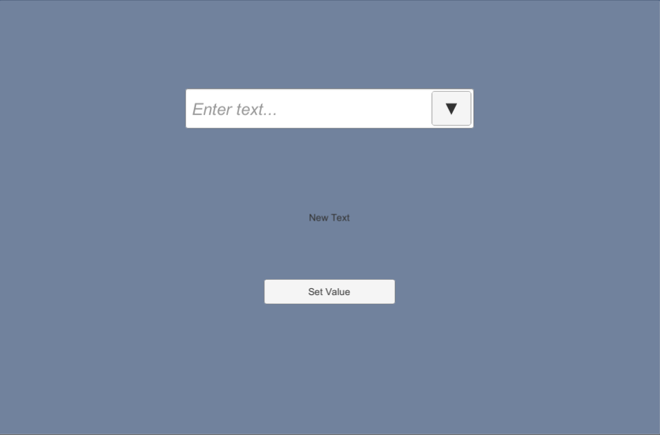
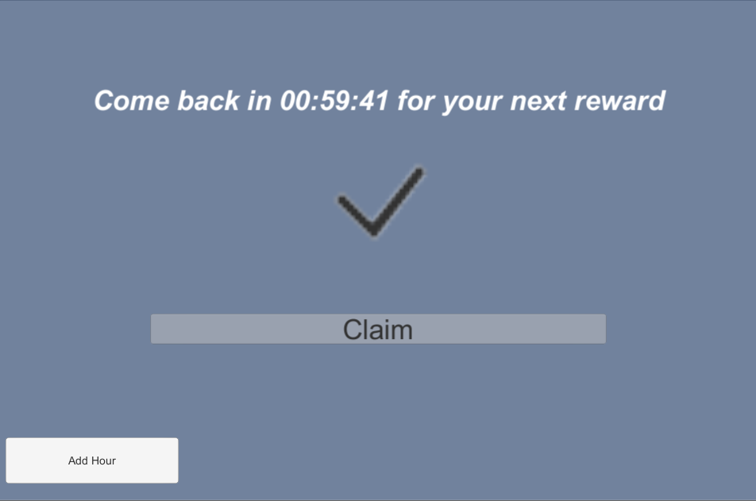
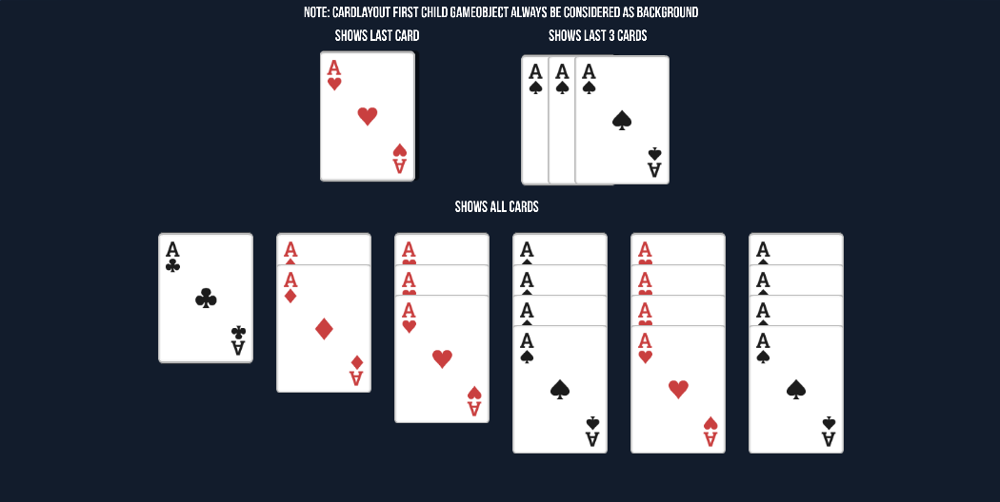
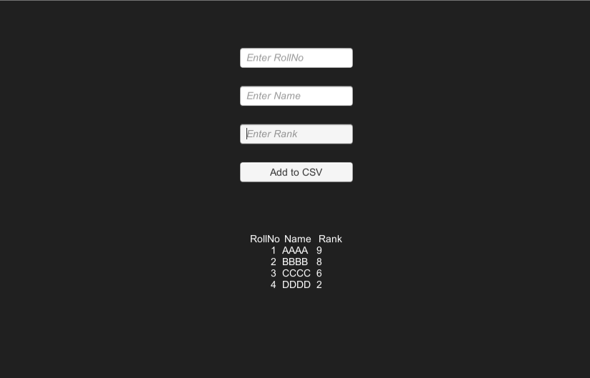
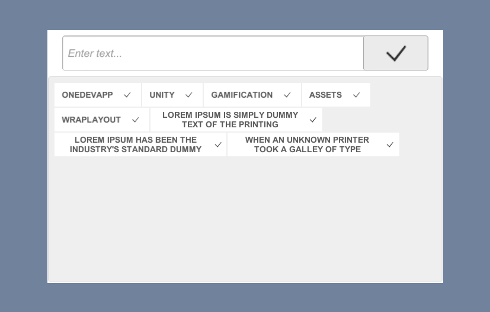

# Unity_Gamification_Assets

Useful template assets for unity

# Assets

# WebCam
Access WebCam from Unity and render it in RawImage, can toggle between available webcams. (Captures only Photo)

ScreenShots


# AutoCompleteDropDown 
A DropDown with Inputfield to filter the dropdown values

ScreenShots




# DailyRewards
DailyRewards provides a rewards daliy basis

ScreenShots


# DatePicker 
Date picker with two design

ScreenShots


# EncryptedPlayerPrefs
Playerprefs values are encrypted 

# Facebook 
Facebook helper functions

# FTPManager
Helper function to connect FTP and downloads a file within Unity

# Google
# Achievements
Achievements helper functions 

# Leaderboard
Leaderboard helper functions 

# Save Score
Save Score helper functions 

# HourlyRewards
HourlyRewards provides a rewards hourly basis 

ScreenShots




# NetworkCallback
Network callback asset provides callback action on api request.

# Pagination
Pagination asset provides images to move left or right with dots indicator.

ScreenShots


# PanZoomUIImage
PanZoomUIImage asset helps image to pan, zoom with both mouse and touch.

ScreenShots


# ParallaxScrollEffect
ParallaxScrollEffect asset helps images to move either vertically or horizontally.

ScreenShots


# PDFViewer
PDFViewer helps to view PDF inside unity, its converts pages into multiple images and renders into image. (Using Ghostscript Lib)

# PlayingCards
# CardFlip Animation
Playing card flip animation using DoTween Animation

ScreenShots


# CardLayout
Card layout is a group layout helps cards to align in 3 different ways. (Best suits for Solitaire)

ScreenShots




# DragNDrop
Drag and Drop images


ScreenShots

# RummyLayout
Rummy layout is a group layout helps cards to align in groups and also creates new group. (Best suits for Rummy)

ScreenShots


# PoolManager
Asset helps to reuse poolable item rather destory and instantiate

ScreenShots


# QRCode
QRCode helps to create and read a QRCode with in unity. (Using Zxing Lib)

ScreenShots


# RectScreenShot
RectScreenShot helps to capture a recttransform

ScreenShots


# SceneLoader
SceneLoader asset provides loading screen while chaning scenes with 3 ways - Instant, Press any key and Press Button

ScreenShots


# ScrollableText
ScrollableText useful for showing huge text to autoscroll. (Like in credits screen, Privacy Policy etc)

ScreenShots


# SimpleCSV
SimpleCSV asset helps to read and write a CSV file within Unity

ScreenShots




# Singleton
An Abstract Singleton class for both Monobehaviour and Non Monobehaviour class.

# SMTPManager
Helper function to connect SMTP and send Email within Unity

# SpinWheel
SpinWheel provides a wheel with rewards 

# UIFlipOrientation
UIFlipOrientation asset helps the group layout to chage its orientation based on device orientation.

ScreenShots


# WrapLayout
WrapLayout asset helps the group layout to align all text elemets to wrap within the group layout

ScreenShots




# LoggerUtils
Logger utility for logging custom error or log messages to console and file.

```C#
public enum LogOutput : byte
{
    Unity = 0,
    Console = 1,
    FileOnly = 2
}

private void Awake()
{
#if UNITY_EDITOR
    LoggerUtils.ToogleLogOnDevice(true);
    LoggerUtils.SetLogProfile(LogProfile.UnityDebug);
#endif

    LoggerUtils.LogWarning("FirstLog");
}

```

# Playfab
PlayFab is a complete backend platform for live games with managed game services, real-time analytics, and LiveOps. PlayFab enables developers to use the intelligent cloud to build and operate games, analyze gaming data and improve overall gaming experiences.

# UserDeviceInfo
* Device Location
* Device Unique Id
* Device Mac Address
